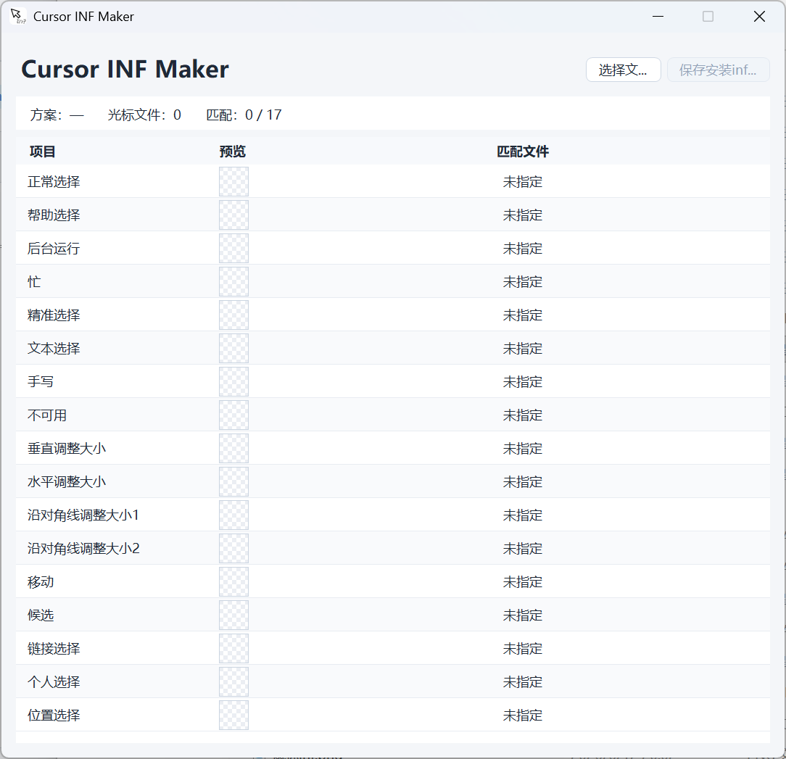

  

<h1 align="center">Cursor INF Maker</h1>

  一个轻量、干净的 Windows 鼠标指针 INF 安装文件生成工具。

  
  
  
  

  

## 简介

Cursor INF Maker 用于把一组 `.cur` / `.ani` 鼠标指针文件整理成 Windows 可安装的 `~右键安装.inf`。选择光标文件夹后，工具会自动匹配 Windows 系统光标项目，显示预览，并在保存时生成可右键安装的 INF 文件。

仓库同时提供桌面端源码和 HTML 版。

- 自动匹配 17 个 Windows 系统光标项目。
- 支持 `.cur` 和 `.ani` 文件，包含动态光标预览。
- 缺失项以浅黄色行标记，保存时自动跳过。
- 生成 Unicode INF，兼容中文文件名和方案名。
- HTML 版无需安装，浏览器中即可生成 INF。
- 桌面版可发布为 Windows x64 自包含单文件程序。

## 使用方法

1. 点击 `选择文件夹`，选择只包含当前光标方案文件的目录。
2. 确认项目、预览、匹配文件是否正确。
3. 点击 `保存安装inf文件`。
4. 在光标文件夹中右键 `~右键安装.inf`，选择安装。
5. 在 Windows 鼠标设置中选择生成的方案。
